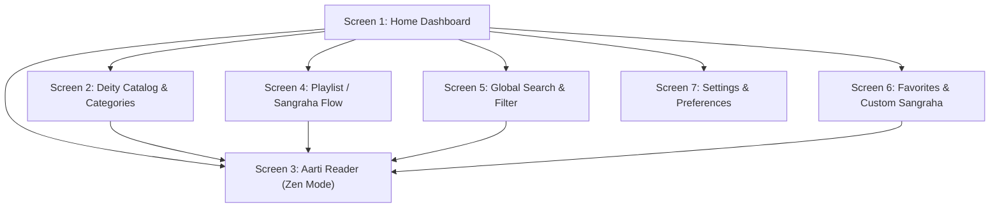
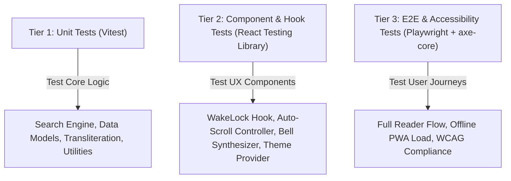

# Aarti Sangraha (आरती संग्रह) — Product Requirements Document (PRD) & Technical Architecture

**Version:** 1.0.0  
**Target Platform:** Mobile-First Web Application (PWA), Hosted on GitHub Pages  
**Tech Stack:** Next.js 14+ (App Router, Static Export `output: 'export'`), TypeScript, Tailwind CSS, Lucide Icons, Web Audio API, Screen Wake Lock API  
**Target Architecture:** 100% Client-Side Static Site Generation (SSG), Offline-First Service Worker Cache  

---

## 1. Executive Summary & Vision

### 1.1 Product Vision
**Aarti Sangraha** is a serene, mobile-first, distraction-free devotional web application designed to be the ultimate digital companion for daily Hindu rituals, evening prayers (*Sandhya Aarti*), and festive gatherings (*Ganesh Utsav*, *Navratri*, *Diwali*).

Key differentiators:
1. **Zero Distraction & No Ads:** Pure spiritual focus with warm, sacred aesthetics (Saffron, Sandalwood, Deep Amber/Diya Glow).
2. **Screen Wake Lock API:** Prevents phone screens from sleeping during continuous recitation or pooja.
3. **Smart Auto-Scroll:** Hands-free scrolling with adjustable speed so users can clap or hold a pooja thali without touching the phone.
4. **Dual-Script & Phonetic Search:** Read lyrics in authentic Devanagari (मराठी / हिंदी) or English transliteration; search in either script.
5. **Interactive Ritual Elements:** Virtual temple bell (*ghanti*) and conch (*shankh*) with realistic Web Audio synthesizer/chimes and haptic feedback.
6. **100% Offline Capability (PWA):** Zero network latency, functional in temple basements or remote locations without cellular data.
7. **Zero Cost Hosting:** Engineered to deploy statically on **GitHub Pages** with GitHub Actions CI/CD.

---

## 2. Target Personas & User Journeys

| Persona | Profile | Needs & Pain Points | Key Feature Utilized |
| :--- | :--- | :--- | :--- |
| **Aaji / Baba (Elderly Devotee)** | 60+ years old, recites aartis daily morning & evening. | Struggles with small fonts, screen dims while singing, confusing cluttered apps with ads. | Large crisp Devanagari font scaling, Screen Wake Lock, high contrast Pooja Mode. |
| **Pooja Performer (Householder)** | 30–50 years old, conducts Ganesh festival or Satyanarayan pooja. | Hands busy holding pooja thali / bell; needs consecutive sequence without fiddling with phone. | Auto-Scroll with tap-to-pause, Pre-configured Aarti Playlists (Ganesh Utsav sequence). |
| **Global Youth / Diaspora** | 15–30 years old, wants to participate in family rituals. | Cannot read Devanagari script fluently; needs pronunciation guidance and English meaning. | English Transliteration toggle, Meaning summary, Phonetic search ("sukhkarta"). |

---

## 3. Information Architecture & Screen Inventory

The application is structured into **6 core mobile-first screens / views**:



### Screen 1: Home Dashboard (`/`)
* **Header:** Date in Hindu calendar (*Tithi/Var*), Quick Search shortcut, Theme switcher, Settings gear.
* **Today's Nitya Niyam:** Dynamic card recommending daily aartis based on Hindu day of week:
  * *Monday:* Lord Shiva
  * *Tuesday:* Lord Ganesha & Hanuman
  * *Wednesday:* Lord Vithoba
  * *Thursday:* Lord Dattatreya & Swami Samarth
  * *Friday:* Devi Durga / Mahalakshmi
  * *Saturday:* Lord Hanuman & Shani Dev
  * *Sunday:* Surya Dev
* **Featured Festivals / Playlists:** Quick access to "Ganesh Utsav Complete Sequence", "Navratri Aarti Sangraha", "Daily Evening Sandhya Aarti".
* **Deities Quick Grid:** Visual avatar icons (Ganesha, Shiva, Devi, Vitthal, Hanuman, Rama/Krishna, Dattatreya).
* **Recent Recitations & Quick Bookmarks:** 1-tap jump to recently read aartis.
* **Bottom Navigation Bar (Sticky Mobile):** Home, Deities, Playlists, Favorites, Search.

### Screen 2: Deity & Category Browser (`/deities` & `/categories`)
* **Tabs / Filters:** All, Aartis, Stotras, Chalisas, Ashtaks, Mantras.
* **Deity Cards:** Rich visual cards showcasing deity name in Devanagari & English, count of hymns, and associated color aura.
* **Alphabetical & Popularity Sorting.**

### Screen 3: Aarti Reader View (`/aarti/[slug]`)
* **App Bar:** Back button, Deity badge, Script toggle (`मराठी` ⇄ `ENG`), Screen Wake Lock indicator (active/inactive), Font size modal trigger (`Aa`), Bookmark toggle.
* **Reader Canvas:**
  * Clean typography with sacred formatting (Chorus indented, distinct stanzas).
  * Auto-Scroll floating control pill: Play/Pause, Speed adjust (`0.5x`, `1x`, `1.5x`, `2x`).
  * Interactive Ritual Widget (optional bottom tray):
    * 🔔 Temple Bell button (plays authentic chime via Web Audio API + haptic pulse).
    * 🪔 Virtual Diya toggle (soft pulsating amber light animation).
    * 🐚 Shankh sound trigger.
* **Footer Controls:** "Next Aarti in Sequence" button, Share lyrics, Meaning / Translation accordions.

### Screen 4: Sangraha / Playlist Mode (`/playlist/[slug]`)
* Continuous ritual playback experience.
* Header showing progress: e.g., *"Step 2 of 5: Shendur Lal Chadhayo"*.
* Prev / Next quick stepper at the bottom without navigating back.
* Option to auto-advance to the next aarti when auto-scroll reaches the bottom.

### Screen 5: Instant Search & Filter (`/search`)
* Search input with instant client-side fuzzy query.
* Dual-script support: Typing `"sukhkarta"` matches `"सुखकर्ता दुःखहर्ता"`.
* Filter chips: Filter by Deity (*Ganesha, Shiva, Devi*), Type (*Aarti, Chalisa, Ashtak*), and Language/Origin (*Marathi, Hindi, Sanskrit*).

### Screen 6: Favorites & Custom Sangraha (`/favorites`)
* User's starred aartis stored in browser `localStorage`.
* Ability to create custom playlists (e.g., *"My Morning Pooja"*, *"Thursday Dattatreya Aarti"*).
* Drag-and-drop or up/down ordering for sequential chanting.

### Screen 7: Settings & Audio Customization (`/settings`)
* **Appearance:** Light (Chandan White), Dark (Charcoal Slate), Pooja Mode (Warm Saffron / Amber Glow).
* **Typography:** Font family selector (Noto Sans Devanagari, Rozha One, Mukta), Default font scale.
* **Ritual Sounds:** Enable/disable bell sound, volume slider, haptic vibration toggle.
* **Screen Settings:** Keep screen awake by default (`WakeLock`).
* **Offline Storage:** Offline cache status indicator, "Download All for Offline Use" button.

---

## 4. Content Architecture & Taxonomy

### 4.1 Data Models (TypeScript)

```typescript
export type ScriptType = 'devanagari' | 'transliteration';

export type HymnType = 'aarti' | 'chalisa' | 'stotra' | 'ashtak' | 'mantra';

export type DeityId = 
  | 'ganesha' 
  | 'shiva' 
  | 'devi' 
  | 'hanuman' 
  | 'vitthal' 
  | 'dattatreya' 
  | 'krishna' 
  | 'rama' 
  | 'surya';

export interface Stanza {
  stanzaNumber: number;
  isChorus?: boolean;
  devanagari: string[];
  transliteration: string[];
  meaning?: string;
}

export interface AartiItem {
  id: string;
  slug: string;
  titleDevanagari: string;
  titleTransliteration: string;
  firstLine: string;
  deity: DeityId;
  type: HymnType;
  language: 'marathi' | 'hindi' | 'sanskrit';
  author?: string;
  stanzas: Stanza[];
  audioUrl?: string; // Optional static audio file
  defaultSpeed?: number;
  tags: string[];
}

export interface Playlist {
  id: string;
  slug: string;
  title: string;
  titleDevanagari: string;
  description: string;
  occasion: string;
  aartiIds: string[];
}
```

### 4.2 Seed Content Inventory (Phase 1 Deliverables)
1. **Lord Ganesha:**
   - *Sukhkarta Dukhharta* (सुखकर्ता दुःखहर्ता) — Samarth Ramdas
   - *Shendur Lal Chadhayo* (शेंदूर लाल चढायो)
   - *Nana Sugandhi Pushpe* (नाना सुगंधी पुष्पे / मखरावरी)
   - *Ghalin Lotangan* (घालीन लोटांगण)
2. **Lord Shiva:**
   - *Lavthavti Vikrala* (लवथवती विक्राळा)
   - *Karpur Gauram Karunavataram* (कर्पूरगौरं करुणावतारम्)
   - *Shiv Chalisa* (शिव चालीसा)
3. **Devi (Durga / Mahalakshmi / Ambe):**
   - *Durge Durgat Bhari* (दुर्गे दुर्घट भारी)
   - *Jai Ambe Gauri* (जय अंबे गौरी)
   - *Mahalakshmi Aarti* (जय देवी जय देवी जय महालक्ष्मी)
4. **Lord Hanuman:**
   - *Aarti Kije Hanuman Lala Ki* (आरती कीजै हनुमान लला की)
   - *Hanuman Chalisa* (हनुमान चालीसा)
5. **Lord Vitthal (Pandharpur):**
   - *Yuge Atthavis* (युगे अठ्ठावीस विटेवरी उभा)
   - *Yei Ho Vitthale* (येई हो विठ्ठले माझे माऊली)
6. **Lord Dattatreya:**
   - *Trigunatmak Traimurti Datta Ha Jana* (त्रिगुणात्मक त्रैमूर्ती दत्त हा जाणा)
7. **Concluding Prayers:**
   - *Mantra Pushpanjali* (मंत्रपुष्पांजली - ॐ यज्ञेन यज्ञमयजन्त देवाः)
   - *Ghalin Lotangan Vandin Charnan* (घालीन लोटांगण वंदीन चरण)

---

## 5. Technical Architecture for GitHub Pages

```mermaid
graph LR
    subgraph Client ["Browser / Mobile Client (PWA)"]
        UI["React 18 + Next.js App Router"]
        SW["Serwist / Workbox Service Worker"]
        IDB["IndexedDB / LocalStorage (Playlists & Favorites)"]
        Audio["Web Audio API (Synthesized Temple Bell)"]
        WakeLock["Screen Wake Lock API"]
    end

    subgraph Build ["Next.js Build Pipeline"]
        SRC["TypeScript Source + Static JSON Aartis"] --> NEXT["Next.js Static Export (output: 'export')"]
        NEXT --> OUT["Static Files (HTML, CSS, JS, Assets) in /out"]
    end

    subgraph Host ["GitHub Pages"]
        GH["GitHub Pages Static CDN"]
    end

    OUT -->|GitHub Action Deploy| GH
    GH -->|HTTPS Static Delivery| Client
```



### 5.1 Static Site Generation (SSG) & Path Resolution
GitHub Pages hosts applications either under a root domain (`username.github.io`) or under a subpath repository (`username.github.io/aarti-sangraha`).

* **`next.config.mjs` Configuration:**
```javascript
/** @type {import('next').NextConfig} */
const isProd = process.env.NODE_ENV === 'production';
const repoName = process.env.NEXT_PUBLIC_REPO_NAME || '';

const nextConfig = {
  output: 'export', // Produces pure static HTML/JS/CSS in /out
  distDir: 'out',
  basePath: isProd && repoName ? `/${repoName}` : '',
  assetPrefix: isProd && repoName ? `/${repoName}/` : '',
  images: {
    unoptimized: true, // Required for static export
  },
  trailingSlash: true, // Clean URL resolution on GitHub Pages
};

export default nextConfig;
```

### 5.2 Device & Browser APIs
1. **Screen Wake Lock API (`navigator.wakeLock`):**
   - Auto-requests `wakeLock.request('screen')` when entering the Aarti Reader view.
   - Automatically releases lock on view unmount or page blur to conserve battery.
   - Visual badge indicates active status to reassure the user.
2. **Web Audio API (Procedural Temple Bell):**
   - No heavy 10MB MP3 sound files needed. Synthesizes an authentic Tibetan/temple brass bell chime using multi-harmonic oscillators (fundamental 659 Hz + upper harmonics with exponential decay).
   - Instant response, zero network latency, 0 KB bundle size overhead.
3. **Vibration API (`navigator.vibrate`):**
   - Provides 40ms subtle haptic feedback when user rings the bell or taps auto-scroll play/pause.
4. **Client-Side Search Index:**
   - In-memory search using `Fuse.js` with n-gram indexing across Devanagari script, English transliteration, and tag categories.

### 5.3 UX & Accessibility (WCAG 2.1 AAA Standards)
* **Contrast Ratios:** Text-to-background contrast >= 7:1 in both light and dark/pooja themes.
* **Typography Hierarchy:**
  * Sanskrit/Devanagari: `font-family: 'Noto Sans Devanagari', 'Mukta', sans-serif;` with line-height of `1.8` for distinct matras (काना, मात्रा, वेलांटी).
  * Scalable font controls: Small (16px), Normal (18px), Large (22px), Extra Large (28px).
* **Touch Targets:** Minimum 48px x 48px touch targets for all interactive buttons.
* **Reduced Motion:** Respects `@media (prefers-reduced-motion: reduce)` for auto-scroll and diya flicker animations.

---

## 6. Test-Driven Development (TDD) Strategy

To ensure rock-solid stability and zero regressions without an active backend, we adopt a **3-Tier TDD Strategy**:



### 6.1 Test Suites Specification

#### Suite 1: Search & Transliteration Engine (`tests/unit/search.test.ts`)
* Given a query in English transliteration `"sukhkarta"`, it must match `"सुखकर्ता दुःखहर्ता"`.
* Given a query with typos `"sukhkartaa"`, fuzzy search must return the relevant hymn with high score.
* Given a filter by deity `"ganesha"`, it must return only Ganesha hymns.

#### Suite 2: Screen Wake Lock Hook (`tests/unit/useWakeLock.test.ts`)
* When reader mounts and wake lock is supported, `request()` is called.
* When document visibility changes to `hidden`, lock is cleanly released.
* When component unmounts, lock is released without memory leaks.
* Graceful fallback when browser does not support `navigator.wakeLock`.

#### Suite 3: Auto-Scroll Hook (`tests/unit/useAutoScroll.test.ts`)
* Increments window scroll position at specified intervals based on speed factor.
* Halts when user manually scrolls or touches the screen (user override).
* Resumes smoothly when play button is clicked.
* Fires `onComplete` callback when scroll reaches bottom.

#### Suite 4: LocalStorage & Playlists (`tests/unit/useFavorites.test.ts`)
* Toggling bookmark updates state and persists to `localStorage`.
* Hydration mismatch prevention: Ensures server render and client hydration match before loading saved bookmarks.

#### Suite 5: Accessibility Audit (`tests/e2e/a11y.spec.ts`)
* Automated Playwright test running `@axe-core/playwright` across Home, Reader, and Search views with zero `critical` or `serious` violations.

---

## 7. Step-by-Step Implementation Roadmap

| Phase | Milestone | Deliverables | TDD Verification |
| :--- | :--- | :--- | :--- |
| **Phase 1** | **Project Scaffolding & CI/CD** | Next.js 14+ App Router, Tailwind CSS, TypeScript, GitHub Pages deploy workflow (`deploy.yml`), Vitest configuration. | Clean build, Vitest passes, GitHub Action dry-run verified. |
| **Phase 2** | **Data Architecture & Search Engine** | Static JSON dataset for Marathi & Hindi Aartis with dual-script schema; Fuse.js search module. | Unit tests for search matching, fuzzy ranking, category filters. |
| **Phase 3** | **Design System & Layouts** | Saffron / Sandalwood / Charcoal theme, Bottom navigation bar, Responsive mobile header, Font scale controls. | Visual consistency, axe-core contrast ratio tests. |
| **Phase 4** | **Zen Reader Experience** | Auto-scroll controller, Screen Wake Lock integration, Devanagari/English script toggle, Web Audio procedural bell chime. | Hook tests for WakeLock, AutoScroll, and Audio Synthesizer mock tests. |
| **Phase 5** | **Sangraha (Playlists) & Favorites** | Sequence player (Consecutive chanting), LocalStorage favorites manager, Custom playlist builder. | LocalStorage hydration tests, playlist progression tests. |
| **Phase 6** | **PWA Offline & Performance Audit** | Manifest, Serwist service worker, pre-caching static assets & JSON, 100/100 Lighthouse audit. | Offline test via Playwright, Lighthouse CLI audit. |
