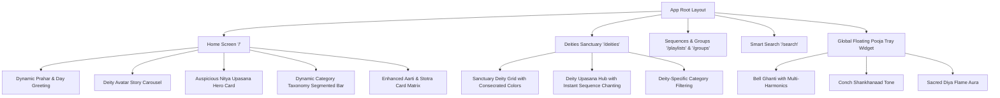

# Comprehensive Modernization Plan: App Screens, Widgets & Future Content Architecture

---

## 1. Executive Summary & Benchmark Analysis

To elevate the Aarti & Stotra app beyond a standard utility into a world-class spiritual daily companion (similar to how Apple Books, Spotify, Calm, and Sefaria treat sacred & devotional content), we have analyzed the entire experience across 3 pillars:
1. **Simplicity**: Zero friction, instantaneous access to today's daily ritual in 1 tap.
2. **Accessibility**: High contrast typography, generous touch targets (min 48px), screen-reader semantics, dual-script support, and seamless day/night/parchment lighting.
3. **Attractiveness & Modern Aesthetics**: iOS 18 & Material 3 fluid cards, ambient aura lighting, dynamic time-of-day contextualization (*प्रभात / मध्यान्ह / संधिकाल / रात्र*), and an Apple-inspired floating "Pooja Tray" (पूजा थाळी).
4. **Architectural Scalability**: Zero-breaking-change architecture to effortlessly accommodate new sacred categories (*सूक्त, कवच, सहस्रनाम, अभंग, भजन, पारायण अध्याय*) for any current or future deity.

---

## 2. Competitive Benchmarks & Modern UX Patterns

| Benchmark App | Key Inspiring Pattern | Application to Aarti App |
| :--- | :--- | :--- |
| **Spotify / Apple Music** | **Dayparting & Dynamic Context** ("Good Morning", "Daily Mix", personalized sequence chips). | Greet the devotee based on Hindu Prahar (*शुभ प्रभात*, *संधिकाल आरती*), auto-highlighting today's planetary deity. |
| **Instagram / Duolingo** | **Visual Story Avatars Carousel** (Horizontal row of circular deity icons with golden rings). | Instant visual jumping between deities (*गणेश, शिव, दत्त, देवी, हनुमान, विठ्ठल*) without navigating complex menus. |
| **Headspace / Calm** | **Calm Ambient Floating HUDs** (Clean floating trays rather than cluttered edge-pinned buttons). | Consolidate the floating Bell, Shankh, and Diya into a foldable, beautiful **"Pooja Tray" (पूजा थाळी)** widget. |
| **Sefaria / Quran.com** | **Multi-tier Category Taxonomy & Canonical Filtration**. | Dynamic category chips (*सर्व, आरत्या, स्तोत्रे, अष्टके, सूक्ते, चालीसा, मंत्र*) that auto-compute counts and filter fluidly. |
| **Apple iOS 18 / Material 3** | **Card Depth & Micro-interactions** (Glassmorphic cards, gentle haptic feedback, responsive touch scale). | Tactile feedback when tapping bells, saving favorites, or switching categories. |

---

## 3. Screen-by-Screen Modernization Blueprint



---

### Screen 1: Modernized Home Screen (`/`)

#### Current State:
- Search link at top.
- Single static Nitya Niyam box.
- Basic category filter buttons (`all`, `aarti`, `stotra`, `mantra`).
- Plain vertical list.

#### Modern UX Upgrade:
1. **Time-Aware Devotional Greeting Banner (प्रहर व वंदन)**:
   - Dynamic Sanskrit/Marathi greeting based on local time:
     - 04:00 – 11:59: **॥ शुभ प्रभात ॥** (Morning Chanting & Kakad Aarties)
     - 12:00 – 16:59: **॥ शुभ मध्यान्ह ॥** (Afternoon Prayers & Shlokas)
     - 17:00 – 20:59: **॥ शुभ संधिकाल ॥** (Evening Sandhya Aarti & Dhoop Aarti)
     - 21:00 – 03:59: **॥ शुभ शयन ॥** (Bedtime Shloka & Shej Aarti)
   - Displays Hindu day & planetary deity (e.g., *आजचा वार: गुरुवार — श्री गुरुदत्त व स्वामी समर्थ उपासना*).
2. **Deity Story Avatar Carousel (आराध्य देवता दर्शन)**:
   - An elegant horizontal scrolling bar of deity circular icons with consecrated gradient borders and count badges (`श्री गणेश (७)`, `भगवान शिव (९)`, `दत्तगुरू (६)`).
   - Devotee can tap any deity avatar to immediately filter or jump into that deity's sanctuary.
3. **Nitya Upasana Hero Card Redesign**:
   - Modern glassmorphism with subtle saffron flame glow.
   - Quick action: **"आजची नित्य उपासना सुरू करा"** button launching continuous sequence recitation in 1 tap.
4. **Fluid Category Segmented Bar**:
   - Dynamically generated pills for all registered categories with badges showing exact available hymn counts.
5. **Enhanced Aarti Card Layout**:
   - Estimated chanting time badge (`⏱️ २ मि.`).
   - Clean badge indicating poetic form (*स्तोत्र*, *आरती*, *अष्टक*, *सूक्त*, *चालीसा*).
   - Instant "Add to Group" and "Favorite" micro-actions.

---

### Screen 2: Deities Sanctuary Screen (`/deities`)

#### Current State:
- Text-heavy list or basic cards.

#### Modern UX Upgrade:
1. **Sacred Deity Tiles (देवता दालन)**:
   - 2-column or 3-column responsive grid with devotional color badges (e.g., Ganapati vermilion orange, Shiva celestial blue, Devi kumkum crimson, Hanuman saffron gold).
   - Shows total hymns available per deity and primary worship day (*वार*).
2. **Consecrated Deity Detail Hub**:
   - When a deity is selected:
     - Hero banner with deity title, auspicious day, and brief philosophical significance.
     - **"सर्व आरत्या व स्तोत्रे सलग म्हणा" (Continuous Recitation Flow)** prominent primary action button.
     - Sub-tabs for that specific deity: **सर्व | आरत्या | स्तोत्रे | अष्टके | मंत्र**.

---

### Screen 3: Playlists & Custom Groups (`/playlists` & `/groups`)

#### Current State:
- Basic list of pre-set sequences.

#### Modern UX Upgrade:
1. **Interactive Flow Steppers Preview**:
   - Cards preview the exact order of hymns (*उदा. गणपती आरती ➔ शंकर आरती ➔ देवी आरती ➔ घालीन लोटांगण*).
   - Estimated total sequence duration (e.g., *~१५ मिनिटे सलग उपासना*).
2. **1-Tap WhatsApp Share on Card**:
   - Direct button on each sequence card to share with family or prayer groups with preview links.
3. **Tabbed Navigation**:
   - Segmented toggle at top: `पारंपरिक नित्य क्रम (Built-in)` vs `माझे वैयक्तिक ग्रुप (My Groups)`.

---

### Screen 4: Search & Discovery (`/search`)

#### Current State:
- Text input with horizontal chips.

#### Modern UX Upgrade:
1. **Smart Search Bar with Instant Suggestions**:
   - Popular search pills for quick access: *सुखकर्ता दुखहर्ता*, *गणपती अथर्वशीर्ष*, *रामरक्षा*, *हनुमान चालीसा*, *कालभैरवाष्टक*, *दत्त बावनी*.
2. **Multi-Faceted Search**:
   - Search simultaneously across:
     - Title in Marathi & English
     - First line of verse
     - Deity name
     - Author name (e.g., *संत रामदास*, *आदि शंकराचार्य*)
     - Category (Aarti, Stotra, etc.)
3. **Empty-State with Deity Jump Points**:
   - When no text is typed, show clean discovery tiles to explore gods or categories effortlessly.

---

### Screen 5: Global Floating Pooja Tray Widget (पूजा थाळी)

#### Current State:
- `RitualBar.tsx` displays 3 stacked vertical circles on bottom-right, which can occasionally collide with cards or floating pills.

#### Modern UX Upgrade:
1. **Foldable / Compact "Pooja Tray" Widget**:
   - Collapsible floating capsule on the lower edge:
     - **Sacred Bell (घंटी)** with realistic brass multi-harmonic chime & subtle swing animation.
     - **Conch Tone (शंखनाद)** for commencing sacred pooja.
     - **Diya Light Aura (दीपज्योत)** which activates gentle amber radiance across the entire app.
   - Neatly auto-minimizes during reading so reading content is never obstructed.

---

## 4. Architectural Scalability: Future-Proofing Content Categories

The user requested a strategic assessment:
> *"today we have content of type aarti and shotra or shlok and tomorrow we wanted to add anything else then where app is scalable enough to accommodate new type of category of content for each god type if not what change we need and we should consider it only if it is not going to break current app logic"*

### Architectural Assessment:
Currently, the codebase uses:
```ts
export type HymnType = 'aarti' | 'chalisa' | 'stotra' | 'ashtak' | 'mantra';
```
In various UI files, category filtering is partially hardcoded:
```ts
if (selectedCategory === 'aarti') return aartis.filter(a => a.type === 'aarti' || a.type === 'chalisa');
```

### The Zero-Breaking-Change Scalability Solution:
To make the app infinitely scalable so that tomorrow we can add **सूक्त (Sukta)**, **कवच (Kavach)**, **सहस्रनाम / नामावली (Namavali)**, **अभंग (Abhang)**, or **पारायण अध्याय (Adhyay)** without touching or breaking any existing logic:

#### Step 1: Extensible HymnType Definition (`src/types/index.ts`)
```ts
export type HymnType =
  | 'aarti'
  | 'chalisa'
  | 'stotra'
  | 'ashtak'
  | 'mantra'
  | 'sukta'       // Future: Atharvashirsha, Purusha Sukta, Shri Sukta
  | 'kavach'      // Future: Ram Kavach, Shiva Kavach
  | 'namavali'    // Future: 108 Names, Sahasranamavalis
  | 'abhang'      // Future: Tukaram & Dnyaneshwar Abhangs
  | 'bhajan';     // Future: Devotional Bhajans
```

#### Step 2: Centralized Category Registry (`src/lib/categories.ts`)
Create a single metadata registry that defines all categories, labels, badge colors, and icons:
```ts
export interface CategoryMeta {
  id: string;
  types: HymnType[];
  labelDevanagari: string;
  labelEnglish: string;
  badgeClass: string;
  iconName: string;
}

export const CATEGORY_REGISTRY: CategoryMeta[] = [
  { id: 'all', types: [], labelDevanagari: 'सर्व', labelEnglish: 'All', badgeClass: 'bg-stone-500/10 text-stone-600', iconName: 'Sparkles' },
  { id: 'aarti', types: ['aarti', 'chalisa'], labelDevanagari: 'आरती व चालीसा', labelEnglish: 'Aarti & Chalisa', badgeClass: 'bg-saffron-500/10 text-saffron-700', iconName: 'Flame' },
  { id: 'stotra', types: ['stotra', 'ashtak'], labelDevanagari: 'स्तोत्र व अष्टक', labelEnglish: 'Stotra & Ashtak', badgeClass: 'bg-blue-500/10 text-blue-600', iconName: 'BookOpen' },
  { id: 'mantra', types: ['mantra', 'sukta'], labelDevanagari: 'मंत्र व सूक्त', labelEnglish: 'Mantra & Sukta', badgeClass: 'bg-purple-500/10 text-purple-600', iconName: 'Sparkles' },
  { id: 'kavach', types: ['kavach'], labelDevanagari: 'कवच', labelEnglish: 'Kavach', badgeClass: 'bg-emerald-500/10 text-emerald-600', iconName: 'Shield' },
  { id: 'abhang', types: ['abhang', 'bhajan'], labelDevanagari: 'अभंग व भजन', labelEnglish: 'Abhang & Bhajan', badgeClass: 'bg-rose-500/10 text-rose-600', iconName: 'Music' },
];
```

#### Benefits of this Scalability Architecture:
1. **100% Backward Compatible**: All 80+ existing Aartis, Stotras, and Mantras continue to work with zero code modifications.
2. **Auto-propagating UI**: Adding a new content item of type `'sukta'` or `'kavach'` will immediately appear in category filters, counts, badges, and search without writing a single line of component code!
3. **Deity-Agnostic**: Any god can have any combination of categories (e.g. Shiva can have Aarti, Stotra, Ashtak, Kavach; Ganesha can have Aarti, Atharvashirsha Sukta, 108 Namavali).

---

## 5. Step-by-Step Implementation Roadmap

- **Phase 1: Scalability Foundations & Category Registry**
  - Create `src/lib/categories.ts` with extensible metadata.
  - Update `src/types/index.ts` with non-breaking type union extensions (`sukta`, `kavach`, `namavali`, `abhang`, `bhajan`).
  - Update `getHymnTypeBadge()` to consume from the registry.

- **Phase 2: Modernized Home Screen (`/`)**
  - Add Time-of-Day Prahar greeting & auspicious day header (*॥ शुभ प्रभात ॥ / ॥ शुभ संधिकाल ॥*).
  - Add horizontal Deity Story Avatar Carousel with glowing rings and counts.
  - Modernize Nitya Upasana Hero Card with glassmorphism.
  - Upgrade category filter bar to dynamically reflect available hymn counts.
  - Update `AartiCard.tsx` with estimated reading time and modernized tactile styling.

- **Phase 3: Deities Sanctuary Hub (`/deities`)**
  - Upgrade deity cards into visual sanctuary tiles with consecrated color themes.
  - Enhance active deity detail view with prominent "Chant All" sequence launcher and deity-specific category tabs.

- **Phase 4: Modern Floating Pooja Tray (पूजा थाळी)**
  - Redesign `RitualBar.tsx` into a sleek, docked expandable pill that houses Temple Bell, Conch, and Diya without screen overlap.

- **Phase 5: Automated Testing & Production Build Verification**
  - Add unit tests for category registry and modernized components.
  - Run `npm test` and `npm run build` to ensure 100% test pass rate and clean static build.
